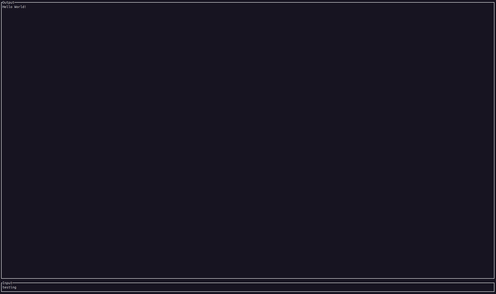

.. _interactive_workflow:

Interactive Emulation
#####################

A common way to interact with emulated programs is via emulated peripherals.  The following demonstrates interacting with an emulated firmware over a virtual UART console.  The target program is a UART echo server, anything received over UART will be echoed back.

With Styx we can use gRPC to efficiently and easily pass data to and from emulated devices, allowing for lots of flexibility when interacting with an emulated target using any language supported by gRPC.  You can find protobuf definitions in ``styx/idl/proto``.

Starting the UART Console/Client
================================

Running the UART client with arguments for what endpoint to connect with as well as the target specific UART interface to use.

.. code-block:: console

    styx-emulator/examples/uart-peripheral-client$ cargo run --release -- --port 16000 --host "127.0.0.1" --uart-interface 5
        Finished `release` profile [optimized] target(s) in 0.48s
        Running `styx/styx-emulator/target/release/uart-peripheral-client --port 16000 --host 127.0.0.1 --uart-interface 5`
    waiting for 127.0.0.1:16000 ...

Running the Emulator
====================

After the emulator starts up we should see a log message stating that the processor is now listening on some port.

.. code-block:: console

    styx-emulator/examples/kinetis21-processor$ cargo run --release
        Finished `release` profile [optimized] target(s) in 0.61s
        Running `styx/styx-emulator/target/release/kinetis21-processor`
    INFO kinetis21_processor: Building processor.
    DEBUG styx_pcode_translator::translator: Register not found in pcode: Xpsr
    INFO styx_cpu_pcode_backend::memory::space_manager: Adding space to manager Constant: Space { info: SpaceInfo { word_size: 1, address_size: 8, endian: LittleEndian, id: Integer(0) }, memory: Mutex { data: Const(ConstMemory { endian: LittleEndian }), poisoned: false, .. } }
    INFO styx_cpu_pcode_backend::memory::space_manager: Adding space to manager Ram: Space { info: SpaceInfo { word_size: 1, address_size: 4, endian: LittleEndian, id: Integer(100841012347920) }, memory: Mutex { data: StyxStore(StyxStore { bank: MemoryBank { regions: RwLock { data: [], poisoned: false, .. }, min_address: 18446744073709551615, max_address: 0 } }), poisoned: false, .. } }
    INFO styx_cpu_pcode_backend::memory::space_manager: Adding space to manager Register: Space { info: SpaceInfo { word_size: 1, address_size: 4, endian: LittleEndian, id: Integer(100841012331664) }, memory: Mutex { data: BlobStore(BlobStore(size: 20000)), poisoned: false, .. } }
    INFO styx_cpu_pcode_backend::memory::space_manager: Adding space to manager Unique: Space { info: SpaceInfo { word_size: 1, address_size: 4, endian: LittleEndian, id: Integer(100841012335824) }, memory: Mutex { data: BlobStore(BlobStore(size: 4294967295)), poisoned: false, .. } }
    INFO styx_cpu_pcode_backend::memory::space_manager: Adding space to manager Other(OTHER): Space { info: SpaceInfo { word_size: 1, address_size: 8, endian: LittleEndian, id: Integer(100841012373072) }, memory: Mutex { data: ByteHashStore(HashStore { backing: {} }), poisoned: false, .. } }
    DEBUG styx_kinetis21_processor::bit_banding: Creating a band at 536870912, alias at 570425344
    DEBUG styx_kinetis21_processor::bit_banding: Creating a band at 1073741824, alias at 1107296256
    INFO styx_kinetis21_processor::bit_banding: Bit band hooks registered.
    WARN styx_cpu_pcode_backend::arch_spec::arm::call_other: DisableIRQInterrupts called
    DEBUG styx_nvic::hooks: vtor set to: 0, address=0xe000ed08, size=4, data=[0, 0, 0, 0], pc=0x0000053e
    DEBUG styx_kinetis21_processor::systick: starting systick timer
    INFO styx_processor: Processor IPC server listening on port 16000
    ...

Sending and Receiving UART Data
===============================

After the emulator has started its IPC server we can start sending messages, interacting with our emulated target.

