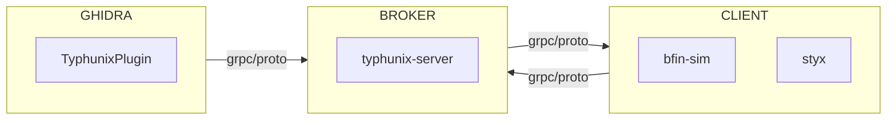
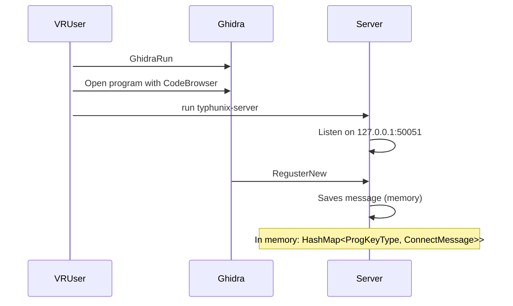
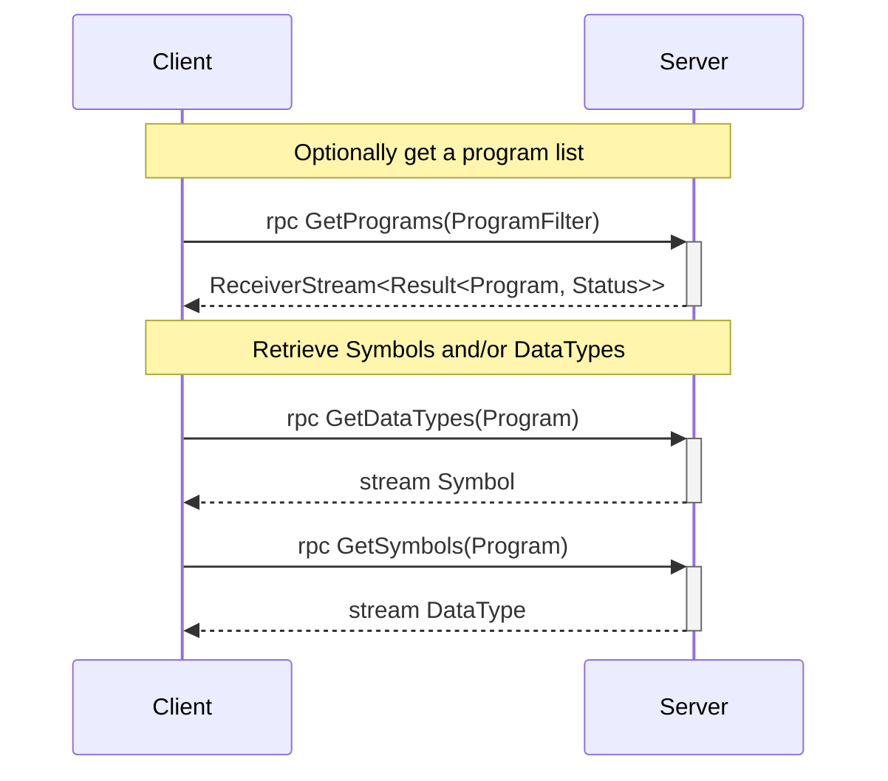
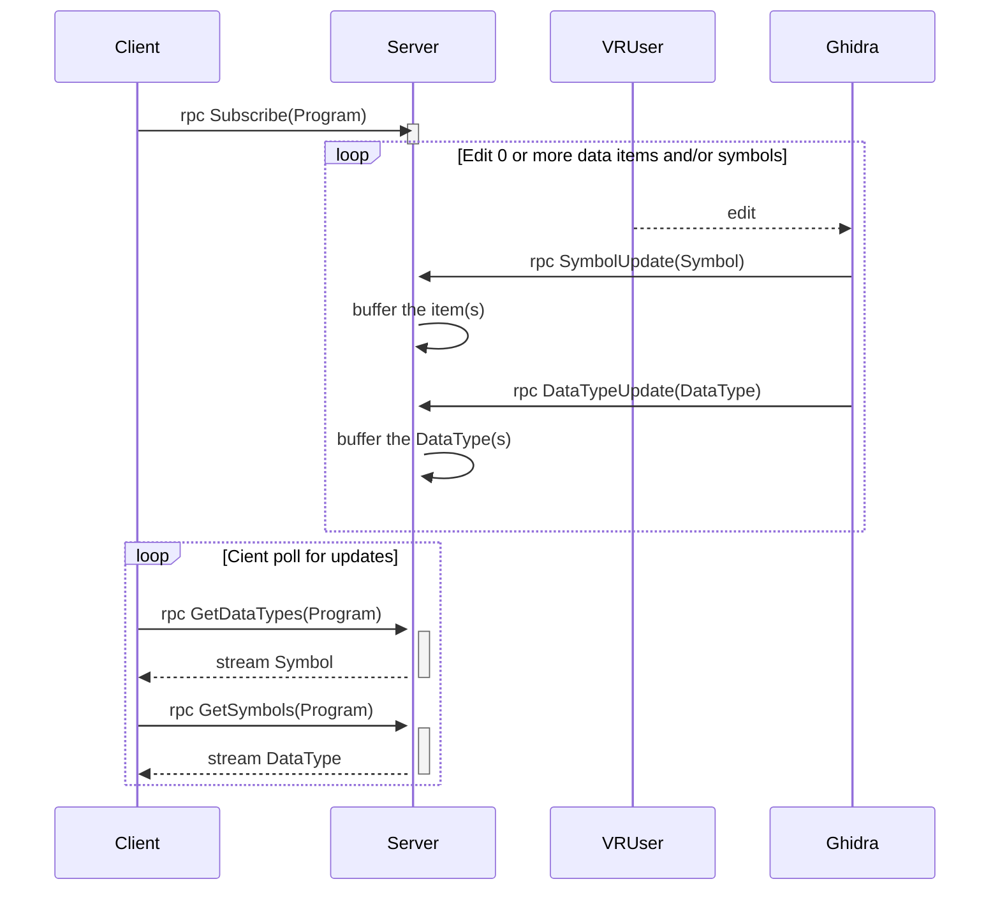

# Typhunix

[Ghidra](https://github.com/NationalSecurityAgency/ghidra) is great, but sometimes you need to get data _from_ Ghidra _to_ somewhere else - enter `Typhunix`.

Typhunix is glueware for integrating Ghidra and another client program (`styx` and, to some extend, `bfin-sim`).



## How to use it?

Typhunix v0.9.0 is a still a little disconnected. Version 1.0.0 will provide a single entrypoint for using Ghidra, the styx-emulator, and the GRPC service.

For now:

1. [Browse Usage Scenarios](#usage-scenarios)
2. [Build it](#build-test-command-line)
3. Install the plugin (Extension) into ghidra
4. Run Server: `rust/target/release/typhunix-server`
5. Run Ghidra
6. Run Emulator (styx or bfin-sim)
7. loop {Find bugs;}

## Status

- [X] Plugin still (static) dumps to JSON
- [X] Plugin serves bulk data via GRPC (ie static dumping)
- [X] Plugin serves edits via GRPC
- [X] Async, Rust-based GRPC server brokers protobuf messages
- [X] Current software target information (name, hash, size etc.)
- [X] Architecture information (stubbed)
- [X] Loader specific information

### Roadmap to typhunix_v1.0

- [X] Python Bindings
- [X] Finish Renaming
- [ ] Streamline launch of Ghidra, GRPC, emulator
- [ ] Bi-directionally control control Ghidra cursor

## Installation

## Build / test - command line

The top level [Makefile](Makefile) has a healthy set of targets. Enable bash-complete to auto-complete targets.

Here are the highest level targets, to build/test/quality check finer grained items, checkout the makefile.

```bash
# Build natively. Infer dependencies from docker/ci/Dockerfile
# using WSL2 / Ububtu22.04
$ export GHIDRA_INSTALL_DIR=/full/path/to/ghidra_10.x.x_PUBLIC
$ make build

# Quality check - rust/java/etc formatting
$ make quality-check

# Run unit tests (see Xvfb note below)
$ make test
```

**NOTE** Ghidra plugin tests use java Swing. To run locally, you must install the X virtual frame buffer tool `Xvfb` and X11 libs:

```ba
sudo apt-get update && sudo apt-get install -y xvfb libxrender1 libxtst6 libxi6
```

## Docker / command line

The bash script [scripts/docker_run.sh](scripts/docker_run.sh) runs arbitrary bash commands in the `ci` container, and preserves dependency caches for `rust` and `gradle`.

Notes:

- to override dependency cache locations, modify `CARGO_HOME` and/or `GRADLE_USER_HOME`
- the first build takes the longest due to dependency download (especially rust)
- Dependencies are downloaded with `user=root`. For rust, modifying the ownership effects the dependency (ie items will appear out-of-date and be re-downloaded). This seems to work:

```bash
# After build with docker_run.sh
find . -user 0 > /tmp/mfiles
cat /tmp/mfiles | xargs sudo chown $(id -u):$(id -g)
# Before another build with docker_run.sh
cat /tmp/mfiles | xargs sudo chown 0:0

```

Examples:

```bash
# build the ci image
$ make image-ci

# or pull ci image
$ docker pull <repository-url>/typhunix/ci:latest

# run make (or any other make target or command)
scripts/docker_run.sh make

# get a bash shell
$ scripts/docker_run.sh

# override CACHE (CARGO_HOME, GRADLE_USER_HOME)
$ CARGO_HOME=~/.cargo scripts/docker_run.sh make build
```

## Build/Test/Run/Debug from VSCODE

- TODO

## Buid/Test/Run/Debug from eclipse

- TODO

## Dev Standards

- For this repo, there are make targets for `pre-commit` (see [web page](https://pre-commit.com/)).

```bash
# Install
make pre-commit-install

# Preview
make pre-commit-run
```

- Use spotless for java, md
- [Rust code style](https://github.com/rust-lang/rfcs/blob/master/text/1574-more-api-documentation-conventions.md#appendix-a-full-conventions-text)
- TODO: helpful vscode plugins

## Install Plugin into Ghidra

The supported Ghidra versions are:

- ghidra_10.1.5_PUBLIC
- ghidra_10.2.3_PUBLIC
- ghidra_10.3.1_PUBLIC

Follow Ghidra procedures for installing an Extension, or basically:

1. Obtain the plugin
2. Launch Ghidra
3. File -> Extensions
4. Hit the plus + button
5. file browse to the `*.zip` file
6. Restart Ghidra

## Obtaining the TyphunixPlugin

The plugin version must correspond with your ghidra version.

- You can download the plugin from the `releases` tab

- You can clone the source tree and build it. Plugins are in dist/**

## Usage Scenarios

## Scenario A: Run Components

In this sequence, a user `VRUser` starts `Ghidra` and runs the GRPC server (`Server`). We assume the latest version of the Plugin is installed and enabled. The user opens a program with `CodeBrowser` which triggers the plugin to send program information to the server.



## Scenario B: Retrieve Symbols/DataTypes

This scenario picks up from [Scenario A](#scenario-a-run-components). The sequence shows the interaction of getting a list of programs registered with the server and retrieving data.



## Scenario C: Subscribe to updates

This scenario picks up from [Scenario B](#scenario-b-retrieve-symbolsdatatypes). The sequence shows the interaction of subscribing / receiving updates from the server/Ghidraa.


