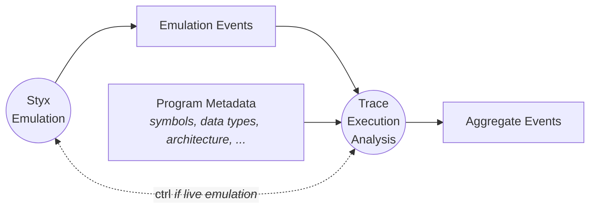
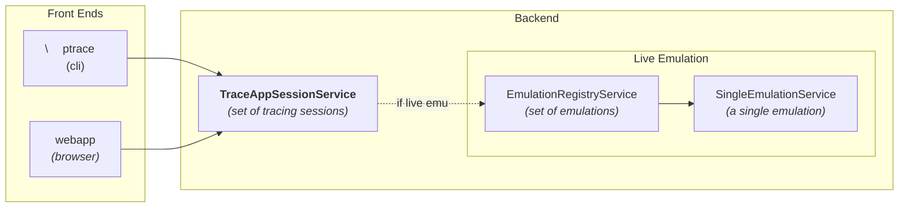

# Trace Execution Analysis

Table Of Contents

Styx emulations are instrumented to emit low level (**Layer 1**) events
_(ie: memory access, instruction execution, register state, etc)_
as a program is executed (emulated).
The list of events is extensible, but all _emulation events_ implement the
`Traceable` trait, dispatched via `TraceableItem`.
Let's refer to these as **emulation events** or **Layer 1** events.

Trace execution analysis is the _(optionally)_ interactive process of
injesting _emulation events_ and emitting _higher order artifacts_ or _events_.
This could include:

- _Emulation events_ enriched with additional information, such as symbolic
names and datatypes to augment numeric addresses and memory locations
- _Emulation events_ enriched with external metadata
- Statistics about the _emulation events_ _(counting and/or summarizing)_
- Visualizations, such as a graph of instruction address, per thread, over time
memory heat maps, ...
- etc.

Trace execution analysis can be also be interactive and support some level of
_time travel debugging_ or _playback_ with the ability to inspect guest state _(memory, variables, instructions, registers, etc.)_ at a moment in time.

For simplification, let's lump all _trace analysis_ outputs into a single thing
 called **AggregateEvents** and say that:

- **Styx emulators emit _Emulation Events_ and Trace Execution Analysis inputs _emulation events _ and external metadata and emits Aggregate Events.**



## Front End Tools

There are 2 front ends for performing _trace execution analysis_: `ptrace`, a command-line tool and `webapp`, an angular web/browser based tool. Both tools support initiation of trace analysis, however the outputs vary: unicode character-based for `ptrace`, html / graphical for the webapp.

## Backend of front-ends

There are three services that support trace analysis. Each is a [gRPC](https://grpc.io/). Each is _thin_: the service implementation only handles network I/O and shared state, with most processing and logic happening in styx library code (crates).



- [SingleEmulationService:](#singleemulationservice) supports managing a single styx emulation: (eg: start, stop, drop, info). It does not depend on any other service.

- [EmulationRegistryService](#emulationregistryservice) supports managing a _set of styx emulations_ (eg: initialize, start, stop, drop, list). It calls `SingleEmulationService` to launch emulations.

- [TraceAppSessionService:](#traceappsessionservice) Supports managing a trace execution analysis session (eg: start, stop, drop, get*, list*). The service supports sessions that have a fixed event list (from a previousely executed emulation) in addition to events that are being ingested as an emulator is emitting them. For the latter case, EmulationRegistryService is used to manage the emulations.

## SingleEmulationService

- Manage single emulation
- Launched dynamically by the [EmulationRegistryService](#emulationregistryservice), which uses
rust's `std::process::Command.spawn()`
- [SingleEmulationServiceExecutor](emulation-service/src/emulation_args.rs)
is an abstraction around emulation args and the rust `spawn()` call.
- the `Processor` is created using `ProcessorFactory` in [ProcessorFactory](emulation-service/src/processor_factory.rs)

## EmulationRegistryService

Simply manages a list of running emulators. Calls out to [SingleEmulationService](#singleemulationservice)
to manipulate the emulation.

## TraceAppSessionService

This service manages trace analysis sessions. In short, [Session](#session) manages state and
is the _conduit_ to [EmuObserver](#emuobserver) which is the central component
ingesting events, processing, then as appropriate, emitting _aggregation events_.
The _aggregate events_ are streaming back to the original requestor _(the client side of the `gRPC`)_
through `Session::process_aggregate_events()`.

The sunny day scenario is:

- `TraceappSessionService::start()` (new async task is spawned)
- If request indicates a new emulation, call out to [EmulationRegistryService](#emulationregistryservice)
- `Session` created _(if needed)_
- `Session::run_request(rx)`
- `EmuObserver::event_stream_from_srb` (live emulations)

    ```rust
    /// Consumes _emulation events _from a IPCTracer (the srb TraceProvider's reader),
    /// processes, emits AggregateEvents
    pub fn events_stream_from_srb<'a>(
        &'a self, key: &str, timeout: Duration,
    ) -> Result<impl Stream<Item = AggregateEvent> + 'a, tonic::Status> {
        let rx = IPCTracer::get_consumer(opts);
        let result = stream! {
            while rx.next_event!(rx, timeout) {
                for e in self.process(event) {
                    yield e // AggregateEvent::*
                }
            }
        }
        ...
    }
    ```

- (OR) `EmuObserver::event_stream_from_raw` (for _playback_)

    ```rust
    /// Consumes _emulation events _from a file, processes, emits AggregateEvents
    pub fn event_stream_from_raw<'a>(
        &'a self, filename: &str,
    ) -> Result<impl Stream<Item = AggregateEvent> + 'a, tonic::Status> {
        let mut raw = RawTraceFile::open(filename, ...);
        let result = stream! {
            while let Some(tr_item) = raw.next_item() {
                for e in self.process(tr_item) {
                    yield e; // AggregateEvent::*
                }
            }
    }
    ```

- `Session::process_aggregate_events(...)`:

    ```rust
    async fn process_aggregate_events(
        &self,
        input_stream: impl Stream<Item = AggregateEvent>,
        output_stream: Sender<Result<StartTraceAppSessionResponse, Status>>,
        request: InitializeTraceRequest,
    ) -> Result<StreamEndReason, Status> {
    ```

### Session

Manages a stateful user traceapp session. A session can be one that is reading _Emulation events_ from a file, (a playback of emulation events) or events from an active emulation, reading from `TraceProvider` interace as they are emitted.

### EmuObserver

Consumes emulation events, emits aggregate events.

- Agnostic as to where the emlation events are being emitted from - in the sense that it doesn't know or care if they are coming from a live emulation or a previousely executed emulation _(playback)_.
- Consumes and processes all emulations events
- Tracks (in memory) guest variables, memory, function calls, isrs, etc.
- Maintains an ISR stack, a function call stack
- emits AggregateEvent events.

### ProcessorFactory

Creates a `styx_machines::processor Processor` based on the emulation arguments.
The primary descriminator is the `Target` (_defined in the `args.proto` file
as an enumeration_). `ProcessorFactory`:
[processor_factory.rs](emulation-service/src/processor_factory.rs)

```rust
pub fn executor_plugin(
    target: &Target,
    executor_plugin: impl ExecutorPlugin,
    trace_plugin: StyxTracePlugin,
    firmware_path: &str,
) -> Result<FactoryResult, StyxMachineError> {
    match target {
        Target::Kinetis21 => {...}
        Target::PowerQuicc => {...}
        Target::Stm32f107 => {...}
    }
}
```

## Requred tools (part of trace analysis stack)

The full stack of service for the `webapp` or `ptrace` to work end-to-end is:

Tool Name|Description
---------------|-----------
envoy          | proxy that enables `gRPC` in the browser
typhunix-server| provides symbols, data types, and architection meta
emuregsvc-svc  | Starts [EmulationRegistryService](#emulationregistryservice)
traceapp-svc   | Starts [TraceAppSessionService](#traceappsessionservice)
emusvc-svc     | **(dynamic)** starts [SingleEmulationServce](#singleemulationservice), called from `EmulationRegistryService`

## Useful Tools (not part of trace analysis stack)

These tools are useful for dev and test, but not part of the stack:

Name|Description
-|-
typhunix-client | Interact with typhunix server
traceapp-cli    | Call `RPC` on [TraceAppSessionService](#traceappsessionservice)
fsink           | Consume _emulation events_ and simply write to a file
strace          | Examine emulation events
emuregsvc-cli   | Call `RPC` on [EmulationRegistryService](#emulationregistryservice)
emusvc-cli      | Call `RPC` on [SingleEmulationServce](#singleemulationservice)
styx-trace      | Launch an emulation in the foreground. Same logic as `emusvc-svc`, but no service
