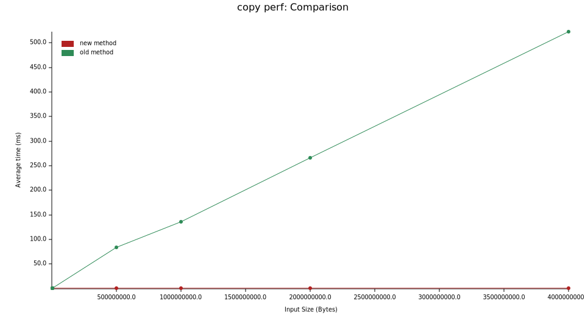

# Styx CoW
A crate for creating copy on write memory regions backed by the OS.  Only supports linux currently.

## Performance Benchmarks
Runtime comparison of cloning a `Vec<u8>` vs cloning a `Cow` struct.  With CoW only modified pages need to be copied which leads to better performance for large chunks of memory.  The breakeven point (at least on my laptop) was for memory regions around 16kB (with 4K pages), for anything smaller than this it is likely faster to just copy the `Vec<u8>`.

